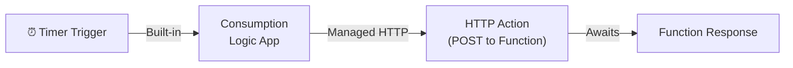
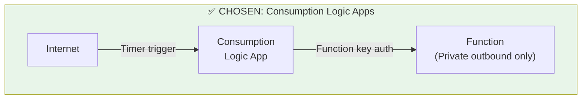
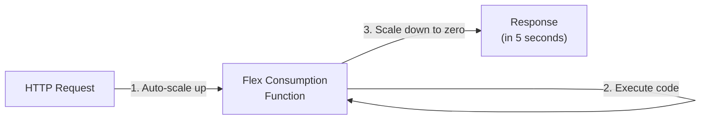
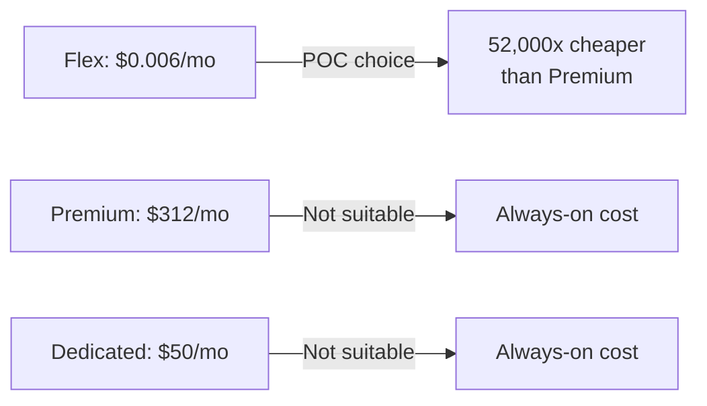
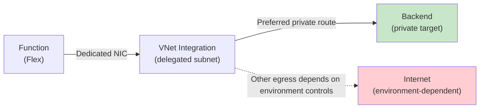
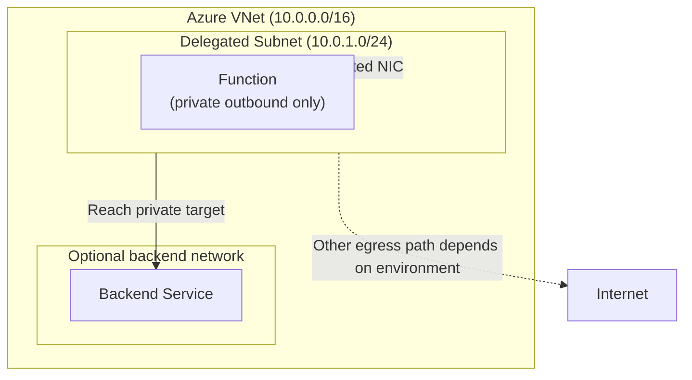
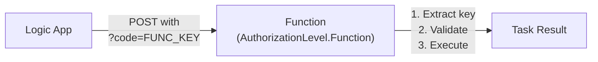
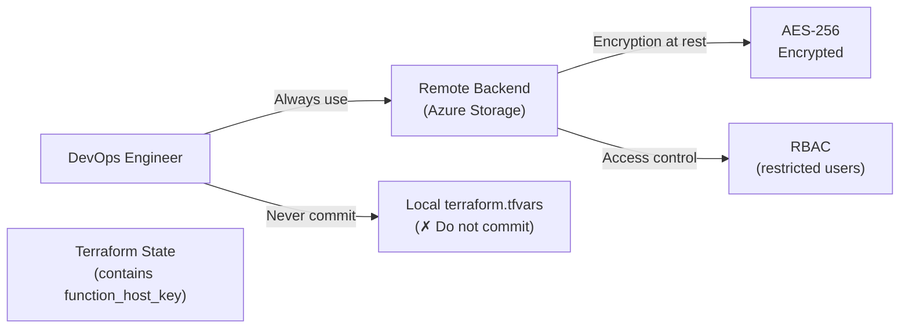
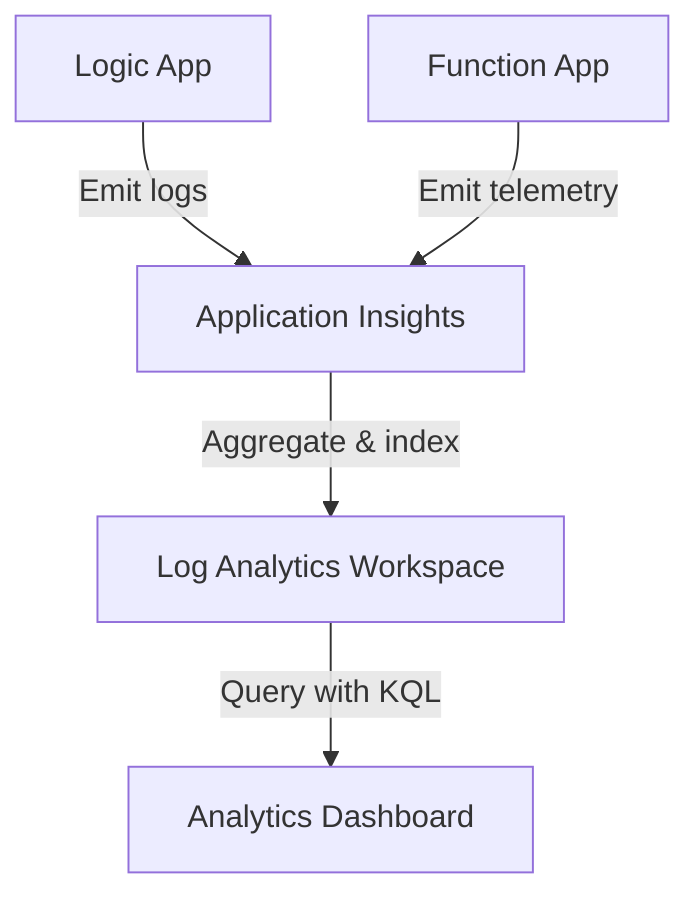
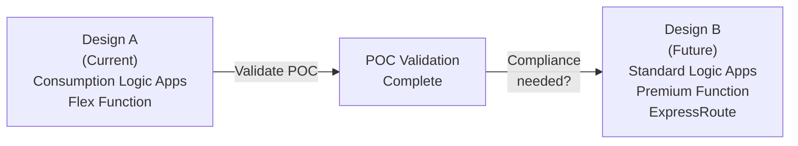

# Architecture Decision Record (ADR) — Logic App + Function POC

This document explains **why** we chose specific Azure services and architecture patterns for this POC.

---

## ADR-001: Consumption Logic Apps vs Standard

### Context

We need a **scheduler** that reliably triggers maintenance tasks on fixed intervals (daily, every 12 hours, weekly).

### Options Considered

#### Option A: Consumption Logic Apps ✅ (CHOSEN)

| Attribute | Value |
|-----------|-------|
| **Inbound access** | Timer-based (built-in) |
| **Outbound calls** | HTTP actions (managed) |
| **VNet required?** | No |
| **Cost model** | Pay-per-action |
| **Monthly cost (POC)** | ~$0.002 |
| **Setup complexity** | Low |

**Diagram:**


#### Option B: Standard Logic Apps ❌ (Rejected)

| Attribute | Value |
|-----------|-------|
| **Inbound access** | VNet-integrated only |
| **Outbound calls** | VNet-integrated only |
| **VNet required?** | Yes |
| **Cost model** | Fixed hourly rate |
| **Monthly cost (POC)** | ~$24–30 |
| **Setup complexity** | High (VNet everywhere) |

#### Option C: App Service Scheduler ❌ (Rejected)

| Attribute | Value |
|-----------|-------|
| **Setup** | Manual HTTP calls (no built-in timer) |
| **Complexity** | Requires separate scheduler app |
| **Cost** | Unpredictable (always-running app service) |

#### Option D: Durable Functions ❌ (Rejected)

| Attribute | Value |
|-----------|-------|
| **Timer support** | Yes, but requires orchestrator pattern |
| **Complexity** | Higher (new programming model) |
| **VNet support** | Via Premium plan only |
| **Cost** | Premium plan minimum $13/day |

### Decision

**Use Consumption Logic Apps** because:
1. **Built-in timer trigger** — no custom scheduler code needed
2. **Extremely low cost** — $0.000025 per execution
3. **No VNet requirement** — simpler infrastructure
4. **Proven for this use case** — perfect for stateless, fixed-schedule patterns

### Trade-offs

| Pro | Con |
|-----|-----|
| ✅ Low cost | ❌ Consumption tier not suitable for high-frequency |
| ✅ Simple setup | ❌ No fully-private inbound (needs internet connectivity to Logic Apps service) |
| ✅ Managed service | ❌ Limited customization vs Standard tier |
| ✅ No VNet overhead | ❌ Standard tier needed for compliance (future) |

### Architecture Impact



---

## ADR-002: Flex Consumption Function vs Premium vs Dedicated

### Context

We need an **HTTP endpoint** that:
- Executes short, lightweight maintenance tasks
- Responds quickly to Logic App invocations
- Scales automatically (we don't know peak load yet)
- Has predictable, low cost

### Options Considered

#### Option A: Flex Consumption ✅ (CHOSEN)

| Attribute | Value |
|-----------|-------|
| **Billing model** | Pay-per-GB-second of execution |
| **Scale to zero** | Yes |
| **Cold start latency** | ~2–5 seconds |
| **Max instances** | 100 (configurable) |
| **Monthly cost (POC, 450 GB-sec)** | ~$0.006 |
| **Suitable for** | Unpredictable, bursty workloads |

**Diagram:**


#### Option B: Premium Plan ❌ (Rejected)

| Attribute | Value |
|-----------|-------|
| **Billing model** | Fixed hourly rate |
| **Scale to zero** | No (always provisioned) |
| **Cold start latency** | ~50 ms (warm) |
| **Max instances** | 20 (based on plan) |
| **Monthly cost (1 instance, always-on)** | ~$312/month |
| **Suitable for** | Predictable, high-frequency workloads |

#### Option C: Dedicated (App Service Plan) ❌ (Rejected)

| Attribute | Value |
|-----------|-------|
| **Billing model** | Fixed monthly (like VM) |
| **Scale to zero** | No |
| **Cold start latency** | Negligible |
| **Idle overhead** | 24/7 running cost |
| **Monthly cost (B1 plan minimum)** | ~$50/month |
| **Suitable for** | Always-on backend services |

#### Option D: Consumption (old) ❌ (Rejected)

| Attribute | Value |
|-----------|-------|
| **Reason rejected** | Legacy plan; VNet integration limited; Flex is newer, better |

### Decision

**Use Flex Consumption Function** because:
1. **Scales to zero** — no cost when idle (POC may not run every day)
2. **Cheapest option** — $0.006/month for our usage pattern
3. **Modern runtime** — supports isolated worker model (.NET 8.0)
4. **VNet integration** — private outbound to backend
5. **Future-proof** — can upgrade to Premium as workload grows

### Trade-offs

| Pro | Con |
|-----|-----|
| ✅ Lowest cost | ❌ Cold start latency (~2–5s) |
| ✅ Scales to zero | ❌ Cannot handle sustained high concurrency (POC doesn't need this) |
| ✅ VNet integration | ❌ Premium more suitable for sub-100ms latency requirements |
| ✅ Pay-per-use | ❌ Unpredictable billing at high scale (unlikely for POC) |

### Cost Comparison



---

## ADR-003: VNet Integration vs Service Endpoints vs No Private Networking

### Context

The Function must call a **backend service** on a private subnet. We need to decide:
- Can outbound traffic go through internet?
- Should we use VNet integration?
- Do we need service endpoints?

### Options Considered

#### Option A: VNet Integration ✅ (CHOSEN)

| Attribute | Value |
|-----------|-------|
| **How it works** | Function app gets a dedicated NIC in delegated subnet |
| **Outbound behavior** | All outbound traffic routes through VNet (not internet) |
| **Cost** | Included in Flex plan |
| **Security model** | Private-by-default |
| **Compliance-friendly** | Yes |

**Diagram:**


#### Option B: Service Endpoints ❌ (Rejected)

| Attribute | Value |
|-----------|-------|
| **How it works** | Virtual network path to specific Azure services (Storage, SQL, etc.) |
| **Outbound behavior** | Restricted to specific services; still uses internet for non-Azure |
| **Use case** | Securing calls to Azure Storage, SQL Database |
| **Not suitable for** | Custom backend services on private subnet |

#### Option C: No Private Networking ❌ (Rejected)

| Attribute | Value |
|-----------|-------|
| **How it works** | Function calls backend via internet |
| **Security** | Backend must have public IP; requires internet authentication |
| **Compliance** | Fails HIPAA, PCI-DSS, SOC2 |
| **Cost** | Slightly lower (no VNet integration) |

#### Option D: Private Endpoint + Private Link ❌ (Overkill for POC)

| Attribute | Value |
|-----------|-------|
| **How it works** | Advanced: private endpoint in Function subnet points to backend |
| **Use case** | Securing calls to managed Azure services (Cosmos, Storage) |
| **Not suitable for** | Custom backend services |
| **Complexity** | High for POC |

### Decision

**Use VNet Integration** because:
1. **Private outbound path** — Function can reach private targets through the delegated subnet
2. **Environment-controlled egress** — outbound behavior can be constrained by surrounding network design
3. **Included in plan** — no extra cost
4. **Compliance-ready** — foundation for future regulated workloads
5. **Simple setup** — Terraform manages delegation automatically

### Trade-offs

| Pro | Con |
|-----|-----|
| ✅ Private-by-default | ❌ Requires VNet (but we need it anyway) |
| ✅ No extra cost | ❌ Slightly more complex networking |
| ✅ Compliance-friendly | ❌ Full isolation still depends on surrounding network controls outside this repo |
| ✅ Easy to restrict | ❌ Cannot easily call internet APIs (but we don't need to) |

### Architecture Impact



---

## ADR-004: Function Key Auth vs Managed Identity vs No Auth

### Context

Logic Apps need to call the Function endpoint. We must decide:
- Should calls require authentication?
- If yes, which authentication method?

### Options Considered

#### Option A: Function Key Auth ✅ (CHOSEN)

| Attribute | Value |
|-----------|-------|
| **How it works** | Function generates a key; caller includes key in query param or header |
| **Key format** | Base64-encoded string (auto-generated by Azure) |
| **Complexity** | Low |
| **Key rotation** | Manual (via Azure CLI or portal) |
| **Cost** | Free (built-in) |
| **Suitable for** | Internal service-to-service calls |

**Diagram:**


#### Option B: Managed Identity ❌ (Rejected for now)

| Attribute | Value |
|-----------|-------|
| **How it works** | Azure AD credential; no key to manage |
| **Key rotation** | Automatic |
| **Complexity** | Medium (requires RBAC, Azure AD) |
| **Suitable for** | Azure service-to-service (scalable) |
| **Overhead** | RBAC policy; Azure AD setup |

**When to use:** If Function endpoint grows to 100+ callers; if using Azure AD for compliance

#### Option C: Anonymous (No Auth) ❌ (REJECTED - SECURITY RISK)

| Attribute | Value |
|-----------|-------|
| **How it works** | Anyone on internet can call the endpoint |
| **Key management** | None |
| **Security** | DDoS and abuse risk |
| **Suitable for** | Public webhooks (not this POC) |

#### Option D: Client Certificate ❌ (Overkill)

| Attribute | Value |
|-----------|-------|
| **How it works** | Mutual TLS; both client and server present certificates |
| **Complexity** | Very high (certificate management) |
| **Suitable for** | High-security regulated environments |
| **Overhead** | Heavy for simple service-to-service |

### Decision

**Use Function Key Auth** because:
1. **Simple** — key embedded in Terraform; Logic App action includes key
2. **Secure enough for POC** — key never exposed (stored in Terraform state)
3. **Low overhead** — no RBAC setup needed
4. **Auditable** — key retrieval tracked in Terraform state
5. **Easy to upgrade** — when moving to production, can transition to Managed Identity

### Trade-offs

| Pro | Con |
|-----|-----|
| ✅ Simple setup | ❌ Manual key rotation needed |
| ✅ Low overhead | ❌ Not suitable for 100+ callers |
| ✅ Key in state file | ❌ Requires secure Terraform state storage |
| ✅ Fast to test | ❌ Managed Identity better for production |

### Key Security: Protect Terraform State



---

## ADR-005: Logging Strategy — Application Insights vs Log Analytics

### Context

We need to track:
- Logic App executions (when they fired, what payload)
- Function invocations (timing, errors)
- Backend calls (success/failure)

### Options Considered

#### Option A: Application Insights + Log Analytics ✅ (CHOSEN)

| Attribute | Value |
|-----------|-------|
| **AI collects** | Traces, metrics, events, dependencies |
| **LA aggregates** | All data; provides querying interface |
| **Cost model** | $2.76/GB ingested; charges only for data sent |
| **Monthly cost (POC)** | ~$0.138 |
| **Query language** | KQL (Kusto Query Language) |
| **Integration** | Built-in to Logic Apps & Function runtime |

**Diagram:**


#### Option B: Application Insights Only ❌ (Incomplete)

| Attribute | Value |
|-----------|-------|
| **Limitation** | No long-term querying; limited retention |
| **Suitable for** | Short-term debugging only |
| **Not suitable for** | Compliance audits, trend analysis |

#### Option C: Custom Logging (Event Hubs + Storage) ❌ (Overkill)

| Attribute | Value |
|-----------|-------|
| **Complexity** | Very high (streaming, ingestion pipeline) |
| **Cost** | Higher ($1+/month for Event Hubs) |
| **Use case** | High-volume streaming analytics (not this POC) |

### Decision

**Use Application Insights + Log Analytics** because:
1. **Built-in to runtime** — no code changes needed
2. **Low cost** — $0.138/month for POC (scales gracefully)
3. **Integrated queries** — KQL for trend analysis
4. **Compliance-ready** — retention policies, audit trails
5. **Standard pattern** — widely documented

### Trade-offs

| Pro | Con |
|-----|-----|
| ✅ Low cost | ❌ KQL learning curve (but well-documented) |
| ✅ Built-in | ❌ Charges based on data volume (monitored) |
| ✅ Long-term storage | ❌ Not real-time streaming (POC doesn't need it) |
| ✅ Easy queries | ❌ Premium features cost extra |

---

## ADR-006: Terraform for Infrastructure as Code vs ARM Templates vs Bicep

### Context

We need to define and deploy Azure resources consistently and repeatably.

### Options Considered

#### Option A: Terraform ✅ (CHOSEN)

| Attribute | Value |
|-----------|-------|
| **Language** | HCL (HashiCorp Configuration Language) |
| **State management** | Explicit state file (tracked) |
| **Multi-cloud** | Yes (AWS, GCP, Azure) |
| **Learning curve** | Medium |
| **Team experience** | Strong (Terraform 1.15.6) |

**Structure:**
```
infra/
  main.tf (main resources)
    network.tf (VNet and subnets)
  function.tf (Function app)
  logicapp.tf (Logic apps)
  variables.tf (inputs)
  outputs.tf (exports)
  environments/
    dev/terraform.private.tfvars (dev values)
    prod/terraform.tfvars.example (prod template)
```

#### Option B: ARM Templates ❌ (Rejected)

| Attribute | Value |
|-----------|-------|
| **Language** | JSON (verbose) |
| **Learning curve** | High |
| **Readability** | Low |
| **Not suitable for** | Maintenance; team scaling |

#### Option C: Bicep ❌ (Alternative; not chosen)

| Attribute | Value |
|-----------|-------|
| **Language** | DSL (simpler than ARM) |
| **State management** | None; stateless deployments |
| **Adoption** | Newer; smaller community |
| **Why not chosen** | Team already experienced with Terraform |

### Decision

**Use Terraform** because:
1. **Team expertise** — developers already know Terraform 1.15.6
2. **Multi-cloud** — skills transferable to AWS/GCP POCs
3. **State management** — explicit tracking of deployed resources
4. **Maturity** — well-documented patterns and modules
5. **Repeatability** — same `terraform apply` = same infrastructure

### Trade-offs

| Pro | Con |
|-----|-----|
| ✅ HCL readable | ❌ State file must be protected (committed to remote backend) |
| ✅ Multi-cloud | ❌ Learning curve for new team members |
| ✅ Mature | ❌ Not native to Azure (vs Bicep) |
| ✅ Reusable modules | ❌ Extra tooling required |

---

## Summary: Architecture Decision Matrix

| Decision | Choice | Cost Impact | Complexity | Rationale |
|----------|--------|------------|-----------|-----------|
| Scheduler | Consumption Logic Apps | $0.002/mo | Low | Built-in timer; cheapest |
| Function | Flex Consumption | $0.006/mo | Low | Scales to zero; pay-per-use |
| Outbound | VNet Integration | Included | Medium | Private-by-default |
| Inbound Auth | Function Key | Free | Low | Simple service-to-service |
| Logging | App Insights + LA | $0.138/mo | Low | Standard pattern; queryable |
| IaC | Terraform | — | Medium | Team expertise |
| **TOTAL** | **Design A** | **~$0.29/mo** | **Medium** | **Cheap, secure, scalable POC** |

---

## Future Migrations

### When to Move from Design A to Design B

Migrate to **fully-private Design B** when:
- ✅ POC is validated and moving to production
- ✅ Compliance requires no internet exposure (HIPAA, PCI-DSS)
- ✅ Security audit mandates on-premises connectivity (ExpressRoute)
- ✅ Trigger frequency warrants Standard Logic App cost

**Migration path:**


---

## Questions?

- **Why not X?** Check the ADR for that component
- **Should we change this?** Propose in a GitHub issue
- **Cost breakdown?** See [ONBOARDING-NEW-CONTRIBUTOR.md](ONBOARDING-NEW-CONTRIBUTOR.md#monthly-costing)

---

**Last updated:** June 2026  
**Architecture Pattern:** Design A (Public Inbound + Private Outbound)  
**Status:** Production-Ready POC
