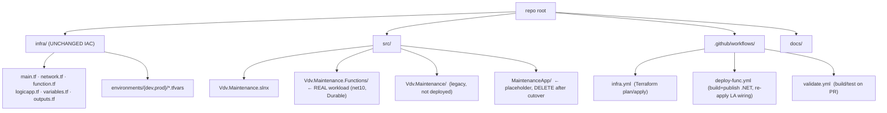
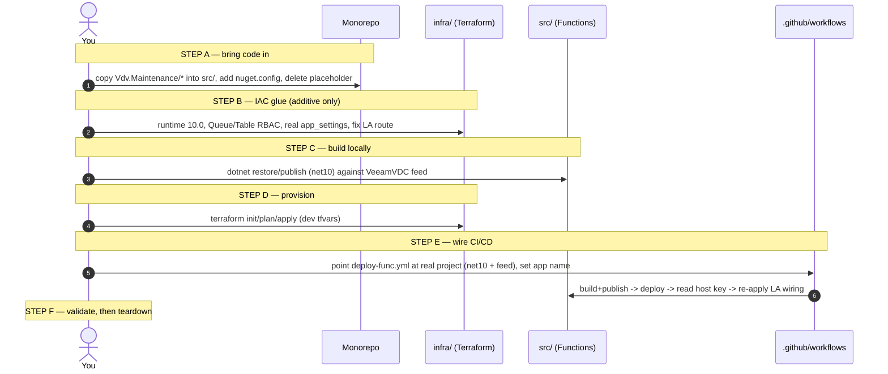

# Combined Monorepo Implementation Plan — IAC + Maintenance Service (with full coding steps)

> **Goal.** Bring the **maintenance service code** into **this same folder/repo**
> alongside the **existing IAC**, so one repository holds both infrastructure
> (`infra/`) and the workload (`src/`). The **IAC code is unchanged from what is
> already in this folder** — this plan only *adds* the maintenance project and
> the glue (app settings, workflows, RBAC) needed to run it.
>
> This is a **coding runbook**: every step shows the exact files, commands, and
> code to write. No agents are built or used.
>
> Companion docs in this folder:
> - `MAINTENANCE-SVC-IMPLEMENTATION-PLAN.md` — the *why* / gap analysis / costing.
> - **This file** — the *how*: concrete monorepo layout + coding steps.

---

## 1. Target monorepo layout

The existing `infra/` stays exactly where it is. The maintenance service from
`vdc-vault-maintenance-svc` (`Vdv.Maintenance/`) moves in under `src/`, replacing
the placeholder `src/MaintenanceApp`.



Final tree:

```
<repo root>/
├─ infra/                              # EXISTING IAC — unchanged
│  ├─ main.tf  network.tf  function.tf  logicapp.tf  variables.tf  outputs.tf
│  └─ environments/{dev,prod}/*.tfvars
├─ src/
│  ├─ Vdv.Maintenance.slnx             # moved in from maintenance repo
│  ├─ Vdv.Maintenance.Functions/       # the deployable Function App (net10, Durable)
│  ├─ Vdv.Maintenance/                 # legacy ASP.NET project (kept, not deployed)
│  └─ (MaintenanceApp/ removed)        # placeholder deleted after cutover
├─ .github/workflows/
│  ├─ infra.yml
│  ├─ deploy-func.yml
│  └─ validate.yml
├─ nuget.config                        # NEW — points at VeeamVDC GitHub Packages feed
└─ docs/
   ├─ MAINTENANCE-SVC-IMPLEMENTATION-PLAN.md
   └─ COMBINED-MONOREPO-IMPLEMENTATION-PLAN.md   # this file
```

---

## 2. Coding sequence overview



---

## STEP A — Bring the maintenance code into the monorepo

### A1. Move the project in

```powershell
$ROOT = "C:\Users\r.wankhede\Downloads\logicapp-func-private-net-feat-poc-governance-memory-tuning\logicapp-func-private-net-feat-poc-governance-memory-tuning"
$MSVC = "C:\Users\r.wankhede\Downloads\vdc-vault-maintenance-svc-develop\vdc-vault-maintenance-svc-develop\Vdv.Maintenance"

# Copy the solution + projects into src/ (keep folder names so the .slnx paths resolve)
Copy-Item -Recurse -Force "$MSVC\*" "$ROOT\src\"

# Remove the placeholder function project once the real one is in place
Remove-Item -Recurse -Force "$ROOT\src\MaintenanceApp"
```

> Keep `Vdv.Maintenance.slnx` and the `Vdv.Maintenance.Functions/` +
> `Vdv.Maintenance/` folders together — the solution references them by relative
> path. Only `Vdv.Maintenance.Functions` is deployed; the legacy
> `Vdv.Maintenance` ASP.NET project is kept for reference and excluded from
> publish.

### A2. Add `nuget.config` at the repo root (private feed)

The maintenance code restores internal packages from **VeeamVDC GitHub
Packages**. Add a root `nuget.config` so both local builds and CI use the same
sources. **Do not hard‑code the PAT** — it is injected via env var at restore.

`nuget.config`:
```xml
<?xml version="1.0" encoding="utf-8"?>
<configuration>
  <packageSources>
    <clear />
    <add key="nuget.org" value="https://api.nuget.org/v3/index.json" />
    <add key="veeamvdc" value="https://nuget.pkg.github.com/Veeam-VDC/index.json" />
  </packageSources>
  <packageSourceCredentials>
    <veeamvdc>
      <add key="Username" value="%GH_PACKAGES_USER%" />
      <add key="ClearTextPassword" value="%GH_PACKAGES_PAT%" />
    </veeamvdc>
  </packageSourceCredentials>
</configuration>
```

### A3. Ensure secrets aren't committed

Append to `.gitignore` (if not already present):
```gitignore
# local function settings & build output
src/**/local.settings.json
src/**/bin/
src/**/obj/
**/output/
# never commit terraform private vars or state
infra/**/terraform.private.tfvars
infra/**/*.tfstate*
infra/.terraform/
```

---

## STEP B — IAC glue (additive only; existing IAC logic unchanged)

These are **additions/edits inside the existing `infra/` files** to make the
infra match what the real Durable Functions app needs. The structure and naming
of the existing IAC stay the same.

### B1. `infra/function.tf` — runtime to net10

```hcl
  runtime_name    = "dotnet-isolated"
  runtime_version = "10.0"   # was "8.0"; must match Vdv.Maintenance.Functions (net10.0)
```
> Verify availability: `az functionapp list-flexconsumption-runtimes --location westeurope -o table`.
> If 10.0 isn't GA in the region, retarget the csproj to `net8.0` and keep `8.0` here.

### B2. `infra/function.tf` — Durable Functions storage RBAC (required)

Durable Functions use **queues + tables** (not just blobs). Add two role
assignments next to the existing `func_storage` (Blob) assignment:

```hcl
resource "azurerm_role_assignment" "func_storage_queue" {
  scope                = azurerm_storage_account.func.id
  role_definition_name = "Storage Queue Data Contributor"
  principal_id         = azurerm_user_assigned_identity.func.principal_id
}

resource "azurerm_role_assignment" "func_storage_table" {
  scope                = azurerm_storage_account.func.id
  role_definition_name = "Storage Table Data Contributor"
  principal_id         = azurerm_user_assigned_identity.func.principal_id
}
```

Add them to the function's `depends_on`:
```hcl
  depends_on = [
    azurerm_role_assignment.func_storage,
    azurerm_role_assignment.func_storage_queue,
    azurerm_role_assignment.func_storage_table,
  ]
```

### B3. `infra/function.tf` — real app settings

Replace the single `TargetBackendUrl` with the settings the code actually reads:

```hcl
  app_settings = {
    AzureWebJobsStorage__accountName = azurerm_storage_account.func.name
    AzureWebJobsStorage__credential  = "managedidentity"
    AzureWebJobsStorage__clientId    = azurerm_user_assigned_identity.func.client_id

    VaultApiServiceApi          = var.vault_api_url      # Refit IVdvDataApi
    InfraServiceApi             = var.infra_api_url       # Refit IInfrastructureApi
    Environment                 = var.environment         # used to tag AWS account names
    "Azure:Region"              = var.location            # RegionGuard
    "JobScheduler:ActiveRegion" = var.location            # = location so timers stay active
  }
```

### B4. `infra/variables.tf` — add the two backend URL variables

```hcl
variable "vault_api_url" {
  description = "Base URL of vault-api (Refit IVdvDataApi). Placeholder in a personal sub."
  type        = string
  default     = "https://your-vault-api.internal"
}

variable "infra_api_url" {
  description = "Base URL of infra-api (Refit IInfrastructureApi). Placeholder in a personal sub."
  type        = string
  default     = "https://your-infra-api.internal"
}
```

### B5. `infra/logicapp.tf` — fix the HTTP contract

The real route is `POST /api/jobs` with `{jobName,tenantId,parameters}` (not
`/api/jobs/execute` / `{JobName,…}`). Update the action body + URI, and use real
job names:

```hcl
  uri = "https://${azurerm_function_app_flex_consumption.main.default_hostname}/api/jobs${var.function_host_key != "" ? "?code=${var.function_host_key}" : ""}"

  headers = { Content-Type = "application/json" }

  body = jsonencode({
    jobName    = local.schedules_by_name[each.key].job_name  # e.g. "CloseFailedAwsAccountsJob"
    tenantId   = null
    parameters = {}
  })
```

Update the `schedules` defaults / tfvars to use **real** job names from
`JobRegistry` and treat Logic Apps as **manual/ops triggers** (the function's own
NCrontab timers remain the scheduler — see the companion doc §3):

```hcl
schedules = [
  { name = "close-failed-aws", job_name = "CloseFailedAwsAccountsJob", frequency = "Week", interval = 1 },
  { name = "monitor-aws",      job_name = "MonitorAwsAccountsAvailabilityJob", frequency = "Week", interval = 1 }
]
```

> Everything else in `infra/` (RG, VNet + delegated subnet, storage, plan,
> Log Analytics/App Insights, two‑phase host‑key apply) is **unchanged**.

---

## STEP C — Build the function locally (net10 + private feed)

```powershell
$env:GH_PACKAGES_USER = "<your-github-username>"
$env:GH_PACKAGES_PAT  = "<PAT with read:packages on Veeam-VDC>"

cd "$ROOT\src"
dotnet restore Vdv.Maintenance.slnx
dotnet publish Vdv.Maintenance.Functions/Vdv.Maintenance.Functions.csproj -c Release -o .\output

# Must contain the Functions package marker:
dir .\output\.azurefunctions
```

Run it locally to smoke‑test the API surface:
```powershell
cd Vdv.Maintenance.Functions
# create local.settings.json from the example, set AzureWebJobsStorage to UseDevelopmentStorage=true
func start
# in another shell:
curl http://localhost:7071/api/jobs
```

> Durable Functions need a storage emulator locally — install **Azurite**
> (`npm i -g azurite` then run `azurite`) and set
> `"AzureWebJobsStorage": "UseDevelopmentStorage=true"` in `local.settings.json`.

---

## STEP D — Provision infrastructure

```powershell
cd "$ROOT\infra"
terraform init
terraform plan  -out tf.plan -var-file="environments/dev/terraform.private.tfvars"
terraform apply tf.plan
```

This creates the RG, VNet (`snet-func-integration` delegated to
`Microsoft.App/environments`), storage (+ the 3 data‑plane role assignments),
Log Analytics/App Insights, the Flex Consumption Function App, and the Logic App
workflows (without the HTTP action until the host key is supplied in Step E).

---

## STEP E — GitHub workflows (CI/CD)

Three workflows. `infra.yml` is **kept as‑is** (it already does OIDC login,
fmt/validate, plan always, apply gated on manual dispatch). The changes are in
**`deploy-func.yml`** (build the *real* net10 project with feed auth and the
correct app name) and a new **`validate.yml`** for PR builds.

### E1. `deploy-func.yml` — build + deploy the real Functions project

Key edits vs the current placeholder workflow: `.NET 10`, project path to the
real csproj, NuGet feed auth, and the correct `FUNCTION_APP_NAME`.

```yaml
name: Deploy Function

on:
  push:
    branches: [main]
    paths:
      - src/**
  workflow_dispatch:

permissions:
  contents: read
  id-token: write
  packages: read                      # needed to read the VeeamVDC feed

env:
  FUNCTION_APP_NAME: func-demo-dev-weu
  RESOURCE_GROUP_NAME: rg-demo-dev-weu
  DOTNET_VERSION: 10.0.x              # was 8.0.x
  PROJECT_PATH: src/Vdv.Maintenance.Functions/Vdv.Maintenance.Functions.csproj
  TF_VARS_FILE: environments/dev/terraform.private.tfvars

jobs:
  build-deploy:
    runs-on: ubuntu-latest
    steps:
      - uses: actions/checkout@v4

      - uses: actions/setup-dotnet@v4
        with:
          dotnet-version: ${{ env.DOTNET_VERSION }}

      - name: Restore (with VeeamVDC feed)
        env:
          GH_PACKAGES_USER: ${{ github.actor }}
          GH_PACKAGES_PAT: ${{ secrets.GH_PACKAGES_PAT }}   # PAT or GITHUB_TOKEN with packages:read
        run: dotnet restore ${{ env.PROJECT_PATH }}

      - name: Build and publish
        run: dotnet publish ${{ env.PROJECT_PATH }} -c Release -o ./output --no-restore

      - uses: hashicorp/setup-terraform@v3
        with:
          terraform_version: 1.15.6

      - uses: azure/login@v2
        with:
          client-id: ${{ secrets.AZURE_CLIENT_ID }}
          tenant-id: ${{ secrets.AZURE_TENANT_ID }}
          subscription-id: ${{ secrets.AZURE_SUBSCRIPTION_ID }}

      - name: Deploy to Azure Functions
        uses: Azure/functions-action@v1
        with:
          app-name: ${{ env.FUNCTION_APP_NAME }}
          package: ./output

      - name: Read function host key
        id: host_key
        shell: bash
        run: |
          key=$(az rest --method POST \
            --url "https://management.azure.com/subscriptions/${{ secrets.AZURE_SUBSCRIPTION_ID }}/resourceGroups/${{ env.RESOURCE_GROUP_NAME }}/providers/Microsoft.Web/sites/${{ env.FUNCTION_APP_NAME }}/host/default/listkeys?api-version=2022-03-01" \
            --query "functionKeys.default" -o tsv)
          [[ -z "$key" ]] && { echo "no key" >&2; exit 1; }
          echo "host_key=$key" >> "$GITHUB_OUTPUT"

      - name: Re-apply Terraform wiring (adds Logic App HTTP action)
        working-directory: infra
        env:
          ARM_USE_OIDC: "true"
          ARM_CLIENT_ID: ${{ secrets.AZURE_CLIENT_ID }}
          ARM_TENANT_ID: ${{ secrets.AZURE_TENANT_ID }}
          ARM_SUBSCRIPTION_ID: ${{ secrets.AZURE_SUBSCRIPTION_ID }}
        run: |
          terraform init
          terraform apply -auto-approve \
            -var-file=${{ env.TF_VARS_FILE }} \
            -var "subscription_id=${{ secrets.AZURE_SUBSCRIPTION_ID }}" \
            -var "function_host_key=${{ steps.host_key.outputs.host_key }}"
```

### E2. `validate.yml` — PR build/test gate

```yaml
name: Validate

on:
  pull_request:
    paths:
      - src/**
      - infra/**

permissions:
  contents: read
  packages: read

jobs:
  dotnet:
    runs-on: ubuntu-latest
    steps:
      - uses: actions/checkout@v4
      - uses: actions/setup-dotnet@v4
        with:
          dotnet-version: 10.0.x
      - name: Restore + build
        env:
          GH_PACKAGES_USER: ${{ github.actor }}
          GH_PACKAGES_PAT: ${{ secrets.GH_PACKAGES_PAT }}
        run: |
          dotnet restore src/Vdv.Maintenance.slnx
          dotnet build src/Vdv.Maintenance.slnx -c Release --no-restore

  terraform:
    runs-on: ubuntu-latest
    defaults: { run: { working-directory: infra } }
    steps:
      - uses: actions/checkout@v4
      - uses: hashicorp/setup-terraform@v3
        with: { terraform_version: 1.15.6 }
      - run: terraform init -backend=false
      - run: terraform fmt -check -recursive
      - run: terraform validate
```

### E3. Required GitHub secrets

| Secret | Purpose |
|--------|---------|
| `AZURE_CLIENT_ID` / `AZURE_TENANT_ID` / `AZURE_SUBSCRIPTION_ID` | OIDC login (federated credential on an app registration) |
| `GH_PACKAGES_PAT` | Read the VeeamVDC GitHub Packages NuGet feed (`read:packages`) |

> One‑time OIDC setup (app registration + federated credential + role
> assignment) is documented in the companion plan; `infra.yml` and
> `deploy-func.yml` both rely on it.

### E4. Pipeline order

1. **`infra.yml`** (manual dispatch with `apply=true`) → creates the Function App.
2. **`deploy-func.yml`** (push to `main`, `src/**`) → builds net10, deploys code,
   reads host key, re‑applies TF to wire the Logic App HTTP action.
3. Subsequent code changes → only `deploy-func.yml` runs.

---

## STEP F — Validate, then tear down

```powershell
# list jobs (proves the deployed API surface)
curl "https://func-demo-dev-weu.azurewebsites.net/api/jobs"

# trigger one and poll (backend-dependent jobs fail in a personal sub — expected)
$key  = "<host key>"
$body = '{"jobName":"GetVeeamAccountIdJob","tenantId":null,"parameters":{}}'
$r = Invoke-RestMethod -Method Post -Uri "https://func-demo-dev-weu.azurewebsites.net/api/jobs?code=$key" -Body $body -ContentType application/json
Invoke-RestMethod "$($r.statusQueryGetUri)"
```
Check **Application Insights → Transaction search** and the Function **Log
stream**; confirm timer functions are listed and `StaleJobWatchdog` logs every 5
min.

```powershell
cd "$ROOT\infra"
terraform destroy -var-file="environments/dev/terraform.private.tfvars"
```

---

## 3. Coding checklist (do these in order)

- [ ] **A1** Copy `Vdv.Maintenance/*` into `src/`; delete `src/MaintenanceApp`.
- [ ] **A2** Add root `nuget.config` (VeeamVDC feed, env‑var creds).
- [ ] **A3** Update `.gitignore` (local.settings.json, bin/obj, tfstate, private tfvars).
- [ ] **B1** `infra/function.tf`: `runtime_version = "10.0"`.
- [ ] **B2** `infra/function.tf`: add Queue + Table Data Contributor role assignments + `depends_on`.
- [ ] **B3** `infra/function.tf`: real `app_settings` (Vault/Infra API, Environment, Region).
- [ ] **B4** `infra/variables.tf`: add `vault_api_url`, `infra_api_url`.
- [ ] **B5** `infra/logicapp.tf`: route → `/api/jobs`, body → `{jobName,tenantId,parameters}`, real job names.
- [ ] **C** `dotnet restore/publish` net10 against the feed; smoke‑test with Azurite.
- [ ] **D** `terraform init/plan/apply` (dev tfvars).
- [ ] **E1** `deploy-func.yml`: net10, real project path, feed auth, `packages: read`, correct app name.
- [ ] **E2** Add `validate.yml`.
- [ ] **E3** Set `GH_PACKAGES_PAT` + Azure OIDC secrets.
- [ ] **F** Validate API + App Insights; `terraform destroy` to clean up.

---

## 4. What stays unchanged (by design)

- All existing `infra/*.tf` resource definitions and naming.
- The two‑phase host‑key apply flow in `deploy-func.yml`.
- `infra.yml` (OIDC, fmt/validate, gated apply).
- Environment tfvars structure under `infra/environments/`.

The only IAC changes are **additive** (runtime bump, two RBAC roles, real app
settings, two variables, corrected Logic App contract) — required for the real
Durable Functions workload to start and reach its backends.
```
