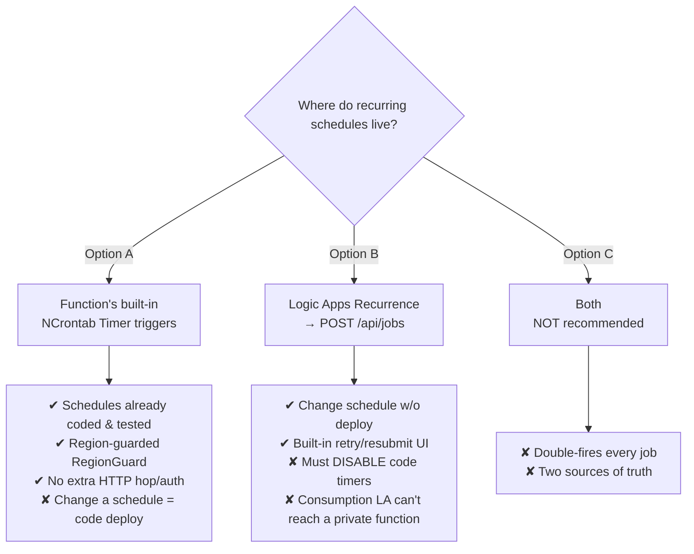
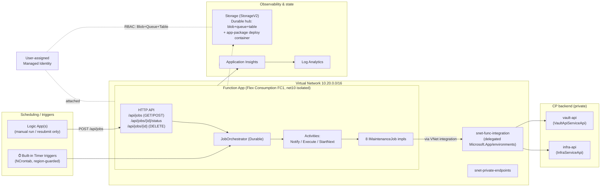
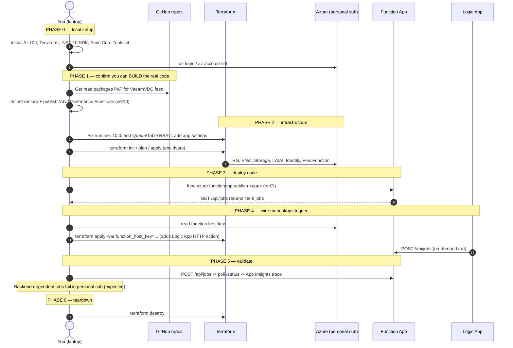

# Maintenance Service on Private‑Network Functions + Logic Apps — Ground‑Up Implementation Plan

> **Scope of this document.** It reviews **two** repos and produces one
> end‑to‑end plan to run the real maintenance service on the private‑network
> infrastructure, first in a **personal Azure subscription**, then mapped to the
> team setup.
>
> - **IaC repo** (this folder): `logicapp-func-private-net` — Terraform for RG,
>   VNet, Flex Consumption Function App, Storage, Log Analytics / App Insights,
>   and Logic App schedulers; plus a *placeholder* C# function in `src/`.
> - **Maintenance code repo:** `vdc-vault-maintenance-svc`
>   (`Vdv.Maintenance/Vdv.Maintenance.Functions`) — the **real** workload: an
>   Azure **Durable Functions** app (net10.0) that runs AWS/storage/tenant
>   maintenance jobs.
>
> **No agents are built or used here** — this is a human/CI runbook only.

---

## 1. Executive summary — read this first

The two repos were built to *almost* the same shape, but there are **five
concrete mismatches** that will stop the real service from running if the IaC is
applied as‑is. The plan in §6 fixes each one. The headline:

| # | Area | IaC repo says | Real maintenance code needs | Severity |
|---|------|---------------|-----------------------------|----------|
| 1 | **Runtime** | `runtime_version = "8.0"`, `DOTNET_VERSION: 8.0.x` | **net10.0** (`Vdv.Maintenance.Functions.csproj`) | 🔴 Blocker |
| 2 | **HTTP contract** | Logic App → `POST /api/jobs/execute` body `{JobName,TargetEnv,ForceRun}` | Real route is `POST /api/jobs` body `{jobName,tenantId,parameters}` | 🔴 Blocker |
| 3 | **Scheduling** | Logic Apps own the schedule (3 recurrence workflows) | App has **its own NCrontab timer triggers** built in | 🟠 Duplication/conflict |
| 4 | **Storage RBAC** | Identity granted only `Storage Blob Data Owner` | Durable Functions also needs **Queue + Table Data Contributor** | 🔴 Blocker |
| 5 | **App settings** | Only `TargetBackendUrl` set | Reads `VaultApiServiceApi`, `InfraServiceApi`, `Environment`, `Azure:Region` | 🔴 Blocker |

Two more environment‑level cautions:

- **Private NuGet feed.** The maintenance build restores from the **VeeamVDC
  GitHub Packages** feed. A personal subscription/GitHub account cannot restore
  these without a PAT that has `read:packages` on that org. This is the first
  thing to confirm before you can even `dotnet publish`.
- **Backends don't exist in a personal sub.** The jobs call `vault-api` and
  `infra-api` (the "CP backend"). In your personal subscription those URLs are
  placeholders, so jobs that hit the backend will fail at the HTTP call. You can
  still validate **infrastructure, deployment, identity, Durable orchestration
  plumbing, timers firing, and the HTTP API surface** — just not real job
  results. Plan the personal POC around that boundary.

**Recommended target design** (justified in §3): keep the **Function App's own
timer triggers** as the scheduler, run the Function with a **private inbound**
endpoint, and use **Logic Apps only for on‑demand/manual job runs and
operational resubmits** against `POST /api/jobs`. Do **not** duplicate all
schedules in Logic Apps.

---

## 2. What each repo actually contains (review)

### 2.1 IaC repo (`infra/`)

| File | Creates |
|------|---------|
| `main.tf` | `azurerm` `~>4.27` + `azapi` `~>2.0`; Resource Group `rg-${product}-${env}-${short_region}` |
| `network.tf` | VNet `10.20.0.0/16`; `snet-func-integration` **delegated to `Microsoft.App/environments`** (outbound VNet integration); `snet-private-endpoints` |
| `function.tf` | User‑assigned identity; Storage (StorageV2, **LRS**, public network on); `app-package` container; **`Storage Blob Data Owner`** role to the identity; Log Analytics (`PerGB2018`, 30‑day); App Insights; **Flex Consumption** plan (`FC1`, Linux); `azurerm_function_app_flex_consumption` (`dotnet-isolated`, **`8.0`**, 2048 MB, VNet‑integrated, identity‑based `AzureWebJobsStorage`) |
| `logicapp.tf` | One `azurerm_logic_app_workflow` **per schedule** + `Recurrence` trigger + `CallFunction` HTTP action → `POST …/api/jobs/execute?code=<host_key>` body `{JobName,TargetEnv,ForceRun}`. The HTTP action is only wired once `function_host_key` is supplied (two‑phase apply). |
| `variables.tf` / env tfvars | `dev` → `function_public_access = true`, 3 schedules; `prod.example` → `function_public_access = false`, no private endpoint resource defined |
| `.github/workflows` | `infra.yml` (plan always, apply gated on manual dispatch, OIDC), `deploy-func.yml` (publishes `src/MaintenanceApp`, reads host key, re‑applies TF) |

> **Design note already baked in:** `snet-func-integration` is correctly
> delegated for Flex Consumption outbound integration. Good. But note `prod`
> sets `function_public_access = false` **with no private endpoint resource** —
> as written, nothing could reach the function in prod (see §3 / fix in §6.4).

### 2.2 Maintenance code repo (`Vdv.Maintenance.Functions`)

- **Model:** Azure **Durable Functions**, **isolated worker**, **net10.0**, `AzureFunctionsVersion v4`.
- **Key packages:** `Microsoft.Azure.Functions.Worker` 2.0.0, `…Extensions.DurableTask` 1.5.0, `…Extensions.Http` 3.2.0, `…Extensions.Timer` 4.3.1, `MediatR` 12.5.0, `Azure.Identity` 1.19.0, `Scrutor` 7.0.0, `Polly`, `NCrontab`, App Insights.
- **HTTP API (`HttpTriggers.cs`, anonymous):**
  - `GET  /api/jobs` — list jobs + metadata/last run/next run
  - `POST /api/jobs` — trigger a job; body `{ "jobName": "...", "tenantId": null, "parameters": { ... } }`; returns `202` + status URL
  - `GET  /api/jobs/{instanceId}/status` — poll orchestration status
  - `DELETE /api/jobs/{instanceId}` — cancel/terminate
- **Built‑in timer triggers (`TimerTriggers.cs`, NCrontab):** e.g. `ClearWorkloadTenantEgressMonthly` (daily 22:00 UTC, last‑day guard), `MonitorAwsAccountsAvailability` + `CloseFailedAwsAccounts` (Sat 01:00 UTC), `RetryHidingSharedKeyRequests` (every 12h); plus `StaleJobWatchdog` every 5 min for recovery.
- **Durable plumbing:** `JobOrchestrator` → `NotifyStatusActivity` → `ExecuteJobActivity` (resolves keyed `IMaintenanceJob`) → `NotifyStatusActivity` → optional `StartJobActivity` (chaining). Hub `VdvMaintenanceHub` on `AzureWebJobsStorage` (**uses blobs, queues AND tables**).
- **8 active jobs** (AWS account create/setup/close/monitor, Veeam account sync, shared‑key retry/scan, monthly egress reset); ~10 disabled.
- **External systems:** Refit clients `IVdvDataApi` (`VaultApiServiceApi`) and `IInfrastructureApi` (`InfraServiceApi`); Managed Identity auth via `Azure.Identity`.
- **Config read:** `AzureWebJobsStorage`, `VaultApiServiceApi`, `InfraServiceApi`, `Environment`, `Azure:Region`, `JobScheduler:ActiveRegion`.
- **Its own CI/CD:** `dev-functions-build-deploy.yaml` (push to `develop`, net10, restores VeeamVDC GH Packages feed, deploys to `func-vdc-vault-maintenance-svc-dev-weu-001`).

---

## 3. Key architectural decision: who schedules?

This is the most important choice and it changes the whole shape.



**Recommendation — Option A as the scheduler, Logic Apps for manual/ops only.**
The maintenance service already ships fully‑formed, region‑guarded timer
triggers. Re‑implementing them as 11 Logic App recurrences (Option B) would mean
*disabling* the code timers and re‑pointing every schedule to `POST /api/jobs`,
plus solving private‑network reachability for the Logic App. Keep Logic Apps for
what they're genuinely good at here: **on‑demand runs and one‑click resubmits**
of a failed job, calling `POST /api/jobs`.

> If you truly want business users to edit schedules without a deploy (the
> original goal), adopt Option B **deliberately**: comment out `TimerTriggers`,
> and because the function is private you must use **Logic Apps *Standard*** with
> VNet integration (Consumption Logic Apps cannot call a private‑endpoint
> function). That is a larger build — out of scope for the personal POC.

---

## 4. Target architecture



**Network directions (do not conflate):**
- **Outbound** Function → `vault-api`/`infra-api`: via `snet-func-integration` (VNet integration) + private DNS for those backends.
- **Inbound** caller → Function: public key‑auth (dev POC) **or** private endpoint in `snet-private-endpoints` with `function_public_access = false` (prod).

---

## 5. Implementation sequence (ground‑up)



---

## 6. Step‑by‑step instructions

### Phase 0 — Local environment (Windows)

```powershell
winget install --id Microsoft.AzureCLI -e
winget install --id HashiCorp.Terraform -e
winget install --id Microsoft.DotNet.SDK.10 -e     # .NET 10 — matches the real csproj
winget install --id Microsoft.Azure.FunctionsCoreTools -e
winget install --id Git.Git -e
winget install --id GitHub.cli -e
# (optional) VS Code + extensions: azurefunctions, csharp, hashicorp.terraform
```
```powershell
az login
az account set --subscription "cf83455a-73e2-41b7-b28b-fbbf1467713d"   # your personal sub from dev tfvars
dotnet --version   # expect 10.0.x
func --version     # expect 4.x
```

> In this Claude Code session you can run an interactive login yourself by
> typing `! az login` in the prompt.

### Phase 1 — Prove you can BUILD the real maintenance code (do this before any infra)

The build is the riskiest unknown on a personal account because of the private
package feed.

```powershell
cd "C:\Users\r.wankhede\Downloads\vdc-vault-maintenance-svc-develop\vdc-vault-maintenance-svc-develop\Vdv.Maintenance"

# Authenticate to the VeeamVDC GitHub Packages NuGet feed (needs a PAT with read:packages).
# Put the PAT in an env var; do NOT commit it.
dotnet nuget add source "https://nuget.pkg.github.com/Veeam-VDC/index.json" `
  --name veeamvdc --username <your-gh-username> --password $env:GH_PACKAGES_PAT --store-password-in-clear-text

dotnet restore Vdv.Maintenance.slnx
dotnet publish Vdv.Maintenance.Functions/Vdv.Maintenance.Functions.csproj -c Release -o .\output
# Confirm it produced a valid Functions package (must contain a .azurefunctions folder):
dir .\output\.azurefunctions
```

- ✅ If publish succeeds → continue.
- ❌ If restore fails on VeeamVDC packages → you cannot run the real code on a
  personal account. Fall back to the **placeholder `src/MaintenanceApp`** in the
  IaC repo to validate the *infrastructure* path, and run the real service only
  in the team subscription where the feed/runner exist.

### Phase 2 — Fix and apply the infrastructure

Apply these **five edits** to `infra/` before `apply` (they close the gaps in §1).
File‑by‑file:

**(a) `function.tf` — bump runtime to net10:**
```hcl
  runtime_name    = "dotnet-isolated"
  runtime_version = "10.0"   # was "8.0" — must match Vdv.Maintenance.Functions (net10.0)
```
> Verify the region supports .NET 10 on Flex Consumption:
> `az functionapp list-flexconsumption-runtimes --location westeurope -o table`.
> If 10.0 isn't yet GA there, retarget the csproj to net8.0 *and* keep TF at 8.0.

**(b) `function.tf` — Durable Functions storage RBAC (the silent killer).**
Durable uses **queues and tables**, not just blobs. Add two role assignments:
```hcl
resource "azurerm_role_assignment" "func_storage_queue" {
  scope                = azurerm_storage_account.func.id
  role_definition_name = "Storage Queue Data Contributor"
  principal_id         = azurerm_user_assigned_identity.func.principal_id
}

resource "azurerm_role_assignment" "func_storage_table" {
  scope                = azurerm_storage_account.func.id
  role_definition_name = "Storage Table Data Contributor"
  principal_id         = azurerm_user_assigned_identity.func.principal_id
}
```
And add both to the function's `depends_on`. Without these the Durable host
fails to create its control queues/history table and **no orchestration starts**.

**(c) `function.tf` — real app settings.** Replace the lone `TargetBackendUrl`
with what the code actually reads:
```hcl
  app_settings = {
    AzureWebJobsStorage__accountName = azurerm_storage_account.func.name
    AzureWebJobsStorage__credential  = "managedidentity"
    AzureWebJobsStorage__clientId    = azurerm_user_assigned_identity.func.client_id

    VaultApiServiceApi          = var.vault_api_url     # Refit IVdvDataApi
    InfraServiceApi             = var.infra_api_url      # Refit IInfrastructureApi
    Environment                 = var.environment        # tags AWS account names
    "Azure:Region"              = var.location           # RegionGuard
    "JobScheduler:ActiveRegion" = var.location           # leave = location so timers are active
  }
```
Add `vault_api_url` / `infra_api_url` variables (placeholders in personal sub).

**(d) `function.tf` — storage replication for Durable.** `LRS` is fine for a
POC. If you later make the function zone‑redundant, switch to `ZRS`.

**(e) Inbound access — pick per environment.** Dev keeps
`function_public_access = true` (key auth). For a private prod, add an
`azurerm_private_endpoint` (subresource `sites`) in `snet-private-endpoints`
with a `privatelink.azurewebsites.net` zone, set `function_public_access=false`,
and remember Logic Apps must then be **Standard** + VNet‑integrated (§3).

Then apply:
```powershell
cd infra
terraform init
terraform plan  -out tf.plan -var-file="environments/dev/terraform.private.tfvars"
terraform apply tf.plan
```

### Phase 3 — Deploy the function code

Either from your laptop:
```powershell
func azure functionapp publish func-demo-dev-weu --dotnet-isolated
# sanity check the live API:
curl https://func-demo-dev-weu.azurewebsites.net/api/jobs
```
…or via CI. **Important:** the IaC's `deploy-func.yml` currently publishes the
**placeholder** `src/MaintenanceApp` with `DOTNET_VERSION: 8.0.x`. To deploy the
real service, either:
- point `deploy-func.yml` at the maintenance repo's Functions project, set
  `DOTNET_VERSION: 10.0.x`, and add the VeeamVDC NuGet auth step; **or**
- let the maintenance repo's own `dev-functions-build-deploy.yaml` deploy to the
  app this IaC created (align the `FUNCTION_APP_NAME`).

### Phase 4 — Wire the manual/ops Logic App trigger

Fix the HTTP contract first: in `logicapp.tf` the action posts to
`…/api/jobs/execute` with `{JobName,…}`. The real route is `POST /api/jobs` with
`{jobName,tenantId,parameters}`. Update the action:
```hcl
  uri  = "https://${azurerm_function_app_flex_consumption.main.default_hostname}/api/jobs${var.function_host_key != "" ? "?code=${var.function_host_key}" : ""}"
  body = jsonencode({
    jobName    = local.schedules_by_name[each.key].job_name  # must be a REAL job name, e.g. "CloseFailedAwsAccountsJob"
    tenantId   = null
    parameters = {}
  })
```
> And use real `job_name` values from `JobRegistry` (e.g.
> `CloseFailedAwsAccountsJob`), not the demo names `UpcomingExpiredPrograms`.

Then complete the two‑phase apply (the deploy workflow already does this):
```powershell
$key = az rest --method POST --url "https://management.azure.com/subscriptions/<sub>/resourceGroups/rg-demo-dev-weu/providers/Microsoft.Web/sites/func-demo-dev-weu/host/default/listkeys?api-version=2022-03-01" --query "functionKeys.default" -o tsv
terraform apply -var-file="environments/dev/terraform.private.tfvars" -var "function_host_key=$key"
```

### Phase 5 — Validate

```powershell
# list jobs
curl https://func-demo-dev-weu.azurewebsites.net/api/jobs
# trigger one (backend-dependent ones will fail in a personal sub — expected)
$body = '{"jobName":"GetVeeamAccountIdJob","tenantId":null,"parameters":{}}'
$r = Invoke-RestMethod -Method Post -Uri "https://func-demo-dev-weu.azurewebsites.net/api/jobs?code=$key" -Body $body -ContentType application/json
# poll status
Invoke-RestMethod "$($r.statusQueryGetUri)"
```
Then check **Application Insights → Transaction search** and the Function's **Log
stream**. Confirm timers appear under Functions and the `StaleJobWatchdog` logs
every 5 min. Backend calls will error against the placeholder URL — that proves
the orchestration path works end‑to‑end up to the network boundary.

### Phase 6 — Teardown

```powershell
cd infra
terraform destroy -var-file="environments/dev/terraform.private.tfvars"
```

---

## 7. Cost estimate

> **Assumptions:** West Europe, USD, pay‑as‑you‑go (no reservations), **low POC
> volume** — the 8 active timers (a few fires/day, longest weekly), `StaleJobWatchdog`
> every 5 min, a handful of manual runs/day, each job seconds→minutes at 2 GB.
> Numbers are **planning estimates** — confirm in the
> [Azure Pricing Calculator](https://azure.microsoft.com/pricing/calculator/).
> Many line items are usage‑based and will be near the low end at POC volume.

### 7.1 Personal POC (dev, public inbound, no private endpoint)

| Component | Pricing basis | Monthly (low–expected) | Annual (expected) |
|-----------|---------------|------------------------:|------------------:|
| Resource Group | Free | $0 | $0 |
| Virtual Network + subnets | Free (no PE/NAT) | $0 | $0 |
| User‑assigned managed identity | Free | $0 | $0 |
| **Function App — Flex Consumption (FC1)** | Per‑execution memory GB‑s + invocations; scales to zero | $3 – $15 | ~$120 |
| **Storage (StorageV2, LRS)** | Durable hub transactions (blob+queue+table) + tiny data + deploy package | $5 – $15 | ~$120 |
| **Log Analytics + App Insights** | Ingestion ~$2.76/GB after 5 GB/mo free; 30‑day retention free | $0 – $15 | ~$90 |
| **Logic Apps (Consumption)** | Per action; 3 low‑freq workflows (manual/ops only) | <$1 | ~$6 |
| **Total (POC)** | | **≈ $10 – $45 / month** | **≈ $180 – $430 / yr** |

### 7.2 Add private inbound (prod‑style, Design B)

| Extra component | Pricing basis | Monthly | Annual |
|-----------------|---------------|--------:|-------:|
| Private endpoint (function `sites`) | ~$0.01/hr ≈ $7.30 + $0.01/GB processed | ~$8 | ~$96 |
| Private DNS zone (`privatelink.azurewebsites.net`) | ~$0.50/zone/mo + queries | ~$1 | ~$12 |
| Logic Apps **Standard** (if used as scheduler, WS1 plan, always‑on) | Fixed plan ~vCPU/mem | ~$175+ | ~$2,100+ |

> ⚠️ The big one: moving schedules into **Logic Apps Standard** (Option B with a
> private function) jumps cost by **~$175+/month** because Standard runs on a
> dedicated always‑on plan — versus **~$0** for the function's built‑in timers
> (Option A). This is a strong financial reason to prefer Option A (§3).

### 7.3 Production‑like (private inbound, Option A timers, higher volume)

| Scenario | Monthly | Annual |
|----------|--------:|-------:|
| Function + Storage + Logs at higher volume + 1 private endpoint + DNS | **≈ $40 – $90 / month** | **≈ $480 – $1,080 / yr** |

**Cost levers:** keep Option A (no Logic Apps Standard); cap Log Analytics with a
daily ingestion cap + 30‑day retention; keep `function_maximum_instance_count`
low (dev = 10); LRS storage for non‑critical envs; let Flex scale to zero.

---

## 8. Risk / gap checklist (carry into the real deployment)

- [ ] **Runtime 10.0** confirmed available on Flex Consumption in the region (else retarget csproj to net8).
- [ ] **Queue + Table Data Contributor** roles added — Durable will not start without them.
- [ ] **App settings** `VaultApiServiceApi`, `InfraServiceApi`, `Environment`, `Azure:Region`, `JobScheduler:ActiveRegion` set.
- [ ] **Logic App body/route** fixed to `POST /api/jobs` with real `jobName`s (or Logic Apps dropped in favour of built‑in timers).
- [ ] **Scheduling decision** made (Option A recommended) — avoid double‑firing.
- [ ] **Private NuGet feed** access (PAT/`read:packages`) available to whoever/whatever builds.
- [ ] **Backends reachable**: in the real env, private DNS + VNet integration resolve `vault-api`/`infra-api`; in personal sub, accept that backend‑dependent jobs fail.
- [ ] **Inbound model** chosen per env: public+key (dev) vs private endpoint (prod). Prod's `public_access=false` must be paired with a PE.
- [ ] **CI/CD reconciled**: one pipeline deploys the *real* Functions project (net10 + feed auth), not the placeholder `src/MaintenanceApp`.
- [ ] **`StaleJobWatchdog`/Durable** transaction volume watched in App Insights for storage cost.

---

## 9. Mapping to the team setup (`vdc-vault-iac-azure`)

When promoting beyond the personal POC, this POC's resources map onto the team
repo's existing modules:

| POC (this repo) | Team repo equivalent |
|-----------------|----------------------|
| `infra/function.tf` Flex app | `modules/function_app` (zone‑redundant, PE‑capable) via `vault/function_app_az.tf` |
| `infra/network.tf` subnets | `modules/vnet` (add a `function-integration` subnet delegated to `Microsoft.App/environments`) |
| Storage / Logs / App Insights | `modules/storage_account`, `modules/log_workspace`, `modules/app_insight` |
| `infra/logicapp.tf` | **net‑new** `modules/logic_app` (none exists) — only if Option B chosen |
| `infra.yml` / `deploy-func.yml` | `.github/workflows/terraform-reusable.yaml` + the maintenance repo's `*-functions-build-deploy.yaml` |
| App name `func-demo-dev-weu` | `func-vdc-vault-maintenance-svc-dev-weu-001` |

> The team `function_app` module documents the exact subnet delegation and the
> "queue/table triggers need extra roles" caveat — i.e. gap #4 above is a
> known issue there too. Reuse that module rather than the hand‑rolled
> `function.tf` when you graduate this work.

---

### References
- Microsoft Learn: *Azure Functions Flex Consumption networking options*; *Durable Functions storage providers (identity‑based connections & required roles)*; *Connect to virtual networks from Azure Logic Apps (Standard)*.
- Terraform Registry: `azurerm_function_app_flex_consumption`, `azurerm_logic_app_workflow`, `azurerm_role_assignment`.
- This repo: `infra/*.tf`, `.github/workflows/*`. Maintenance repo: `Vdv.Maintenance.Functions/{Program.cs,host.json,Triggers,Registry}`.
```
