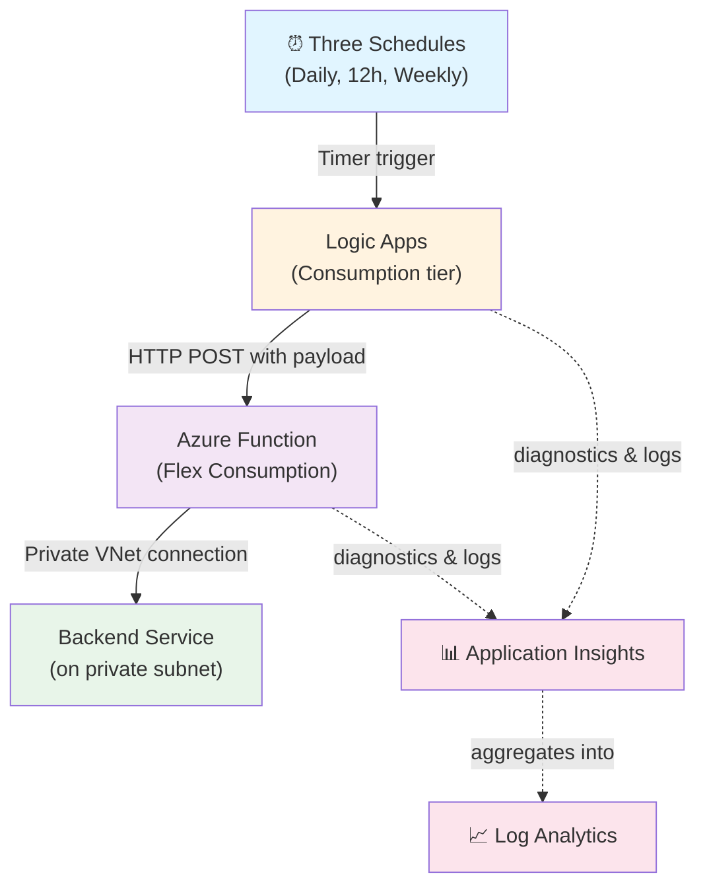
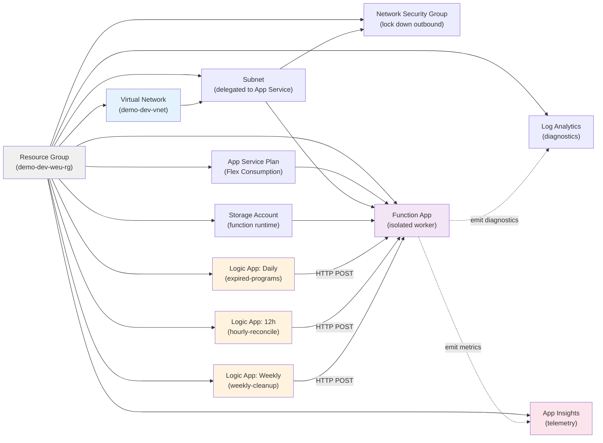
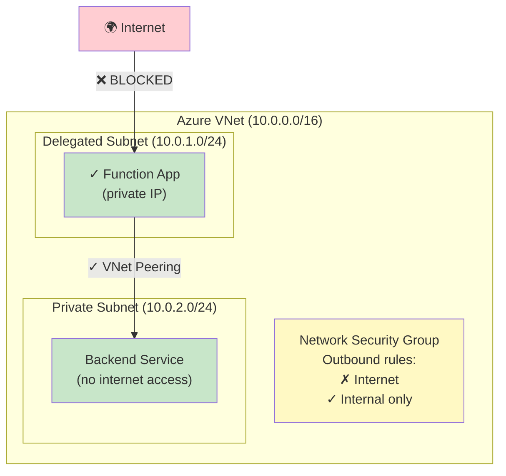
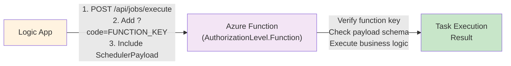
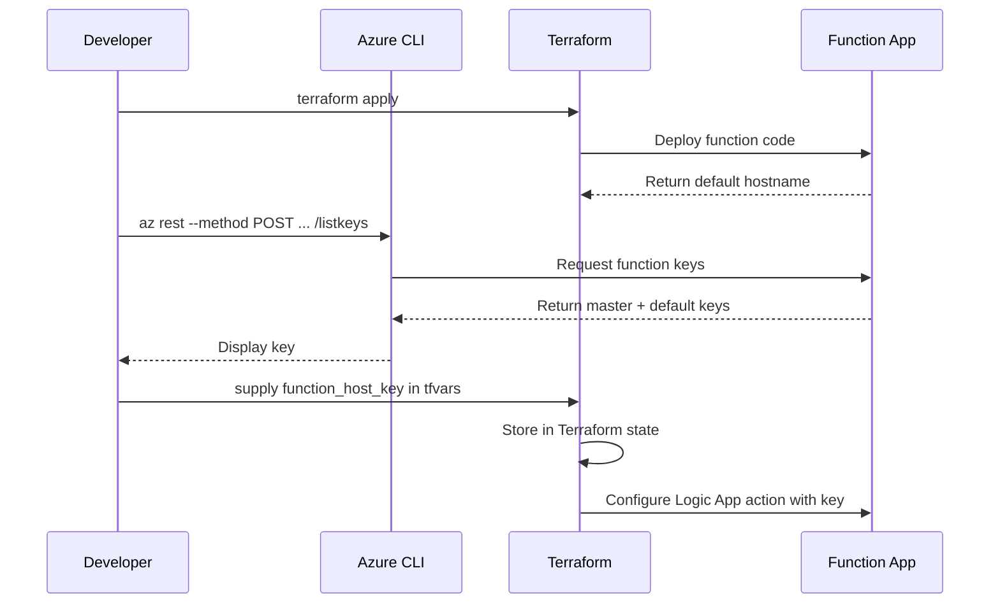
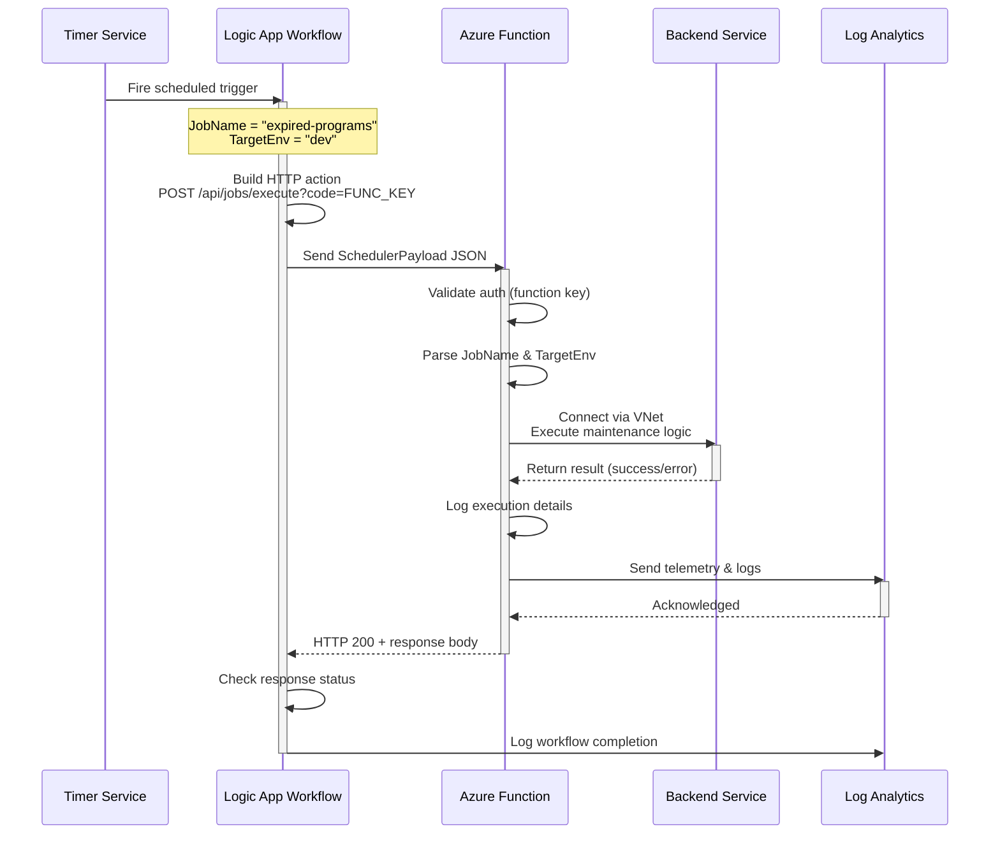
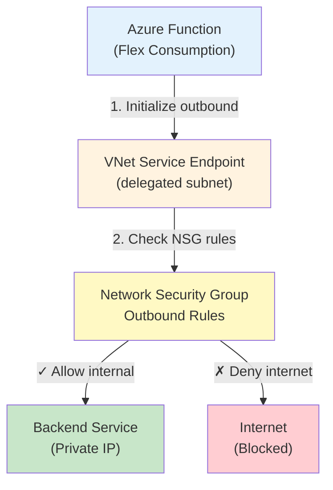
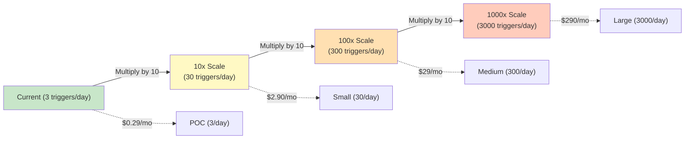

# 🚀 Onboarding Guide: Understanding This POC

Welcome! This guide explains **why** this POC exists, **how** it's built, and **what** it costs.

---

## Table of Contents

1. [Why This POC?](#why-this-poc)
2. [High-Level Architecture](#high-level-architecture)
3. [Detailed Component Wiring](#detailed-component-wiring)
4. [Authentication & Security Model](#authentication--security-model)
5. [Request Flow (Sequence Diagram)](#request-flow-sequence-diagram)
6. [Private vs Public Architectures](#private-vs-public-architectures)
7. [Monthly Costing](#monthly-costing)
8. [Next Steps](#next-steps)

---

## Why This POC?

### Problem Statement

Organizations need to:
- **Orchestrate scheduled maintenance tasks** at predictable intervals
- **Keep internal service calls private** (no exposure to the internet)
- **Scale independently** without managing servers
- **Keep costs predictable** and lean for proof-of-concept work

### Traditional Approach ❌

```
Internet → Logic Apps (public endpoint) → Azure Function (public endpoint) 
         → Backend Service (exposed on internet)
```

**Issues:**
- All services exposed to internet; requires authentication hardening
- Unpredictable traffic; difficult to secure
- Compliance risk in regulated environments

### Our Solution ✅

```
Timer triggers → Logic Apps (private tier) → Azure Function (private networking)
                                           → Backend Service (private subnet only)
```

**Benefits:**
- **Inbound**: Logic Apps call Function via function key (not internet accessible)
- **Outbound**: Function communicates to backend over VNet integration (no internet egress)
- **Cost**: Flex Consumption Function scales down to zero; no idle charges
- **Security**: Defense-in-depth — multiple layers of network isolation

---

## High-Level Architecture

### System Context Diagram



### Why Each Component?

| Component | Purpose | Scaling | Cost Model |
|-----------|---------|---------|-----------|
| **Logic Apps (Consumption)** | Scheduler; timer-driven orchestration | Per action execution | $0.000025/action (pay-per-execution) |
| **Azure Function (Flex Consumption)** | HTTP endpoint; executes business logic | Auto-scales; scales to zero | $0.00001447/GB/sec (pay-per-use) |
| **VNet Integration** | Private outbound traffic for Function | N/A (no separate billing) | Included in Flex plan |
| **Log Analytics** | Centralized logging & query | Data ingestion volume | $2.76/GB ingested (retention) |
| **Storage Account** | Function runtime state | Minimal | ~$1/month (minimal) |

---

## Detailed Component Wiring

### Terraform Resource Map



### Network Isolation Detail



---

## Authentication & Security Model

### Current Design: Function Key Auth



**Why Function Key?**
- Simple: no RBAC setup required
- Auditable: key retrieval and rotation tracked in Terraform
- Secure: key never committed to source control
- Fast: validation happens in Azure runtime

**Key Retrieval Flow**



---

## Request Flow (Sequence Diagram)

### End-to-End: Timer Fire to Backend Response



### Private Outbound Traffic Detail



---

## Private vs Public Architectures

### Design A: Public Inbound + Private Outbound ✅ (Current POC)

**For this POC: DESIGN A**

```mermaid
graph TB
    subgraph Design["Design A: Public Inbound + Private Outbound"]
        Internet["🌍 Internet"]
        LogicApp["Logic Apps<br/>(Consumption)"]
        Function["Function App<br/>(Flex Consumption)<br/>AuthLevel: Function"]
        Backend["Backend Service<br/>(Private)"]
        
        Internet -->|HTTP POST<br/>+ Function Key| LogicApp
        LogicApp -->|HTTP POST<br/>+ Function Key| Function
        Function -->|VNet Int.<br/>(Private)| Backend
    end
    
    style Design fill:#f0f0f0
    style Function fill:#e3f2fd
    style Backend fill:#c8e6c9
    style Internet fill:#ffecb3
```

**Characteristics:**
- Logic Apps use Consumption tier (managed Timer → HTTP action)
- Function inbound requires **Function Key auth** (not internet-unauthenticated)
- Function outbound is **100% private** via VNet integration
- **Estimated monthly cost: ~$3–5** (see [Costing](#monthly-costing) for breakdown)

**Best for:**
- POC / Proof-of-concept work
- Small-scale maintenance tasks (low frequency)
- Environments where public inbound can be authenticated

---

### Design B: Fully Private (Inbound + Outbound) ❌ (Future Option)

```mermaid
graph TB
    subgraph Design["Design B: Fully Private Inbound + Private Outbound (Future)"]
        OnPrem["🔒 On-Premises<br/>or<br/>Private Datacenter"]
        LogicAppStd["Logic App Standard<br/>(VNet integrated)"]
        FunctionStd["Function App<br/>(Premium)"]
        Backend["Backend Service<br/>(Private)"]
        
        OnPrem -->|Private ExpressRoute| LogicAppStd
        LogicAppStd -->|VNet Int.<br/>(Private)| FunctionStd
        FunctionStd -->|VNet Int.<br/>(Private)| Backend
    end
    
    style Design fill:#f0f0f0
    style LogicAppStd fill:#fff3e0
    style FunctionStd fill:#f3e5f5
    style Backend fill:#c8e6c9
    style OnPrem fill:#ffe0b2
```

**Characteristics:**
- Logic Apps use Standard tier (requires VNet integration everywhere)
- Function uses Premium plan (no Consumption option)
- **All traffic** stays within Azure VNet or on-premises via ExpressRoute
- **Estimated monthly cost: ~$100–200+** (Standard Logic App, Premium Function, ExpressRoute)

**Best for:**
- Production regulated environments (HIPAA, PCI-DSS, etc.)
- High-security requirements (no internet exposure)
- Compliance-driven deployments

**Why NOT Design B for this POC:**
- Overkill for development/testing
- Consumption Logic Apps are **much cheaper** ($0.025/action vs $24/day for Standard)
- Premium Function tier has **minimum monthly cost** ($13/day)
- Suitable only after POC is validated and requires compliance

---

## Monthly Costing

### Pricing Breakdown (Current Design A)

```mermaid
graph TB
    subgraph Costs["Azure Services - Monthly Estimate"]
        LogicApp["Logic Apps<br/>(Consumption)")
        Function["Azure Function<br/>(Flex Consumption)"]
        Storage["Storage Account"]
        AppInsights["App Insights"]
        LA["Log Analytics"]
        Network["Networking"]
        
        LogicApp -->|Executions| LE["3 workflows × 365 days<br/>= 1,095 executions/year<br/>≈ 91/month<br/>@ $0.000025/exec<br/>= $0.002/month"]
        
        Function -->|Execution time| FE["Per workflow:<br/>Average 5 sec execution<br/>~1 GB/sec memory<br/>= 5 GB-sec<br/>3 triggers × 30 days<br/>= 450 GB-sec/month<br/>@ $0.00001447/GB-sec<br/>= $0.006/month"]
        
        Storage -->|Blob storage| SE["Function runtime<br/>& diagnostic logs<br/>≈ 100 MB<br/>@ $0.018/GB<br/>= $0.002/month"]
        
        AppInsights -->|Telemetry ingestion| AIE["~50 MB logs/month<br/>@ $2.76/GB<br/>= $0.138/month"]
        
        LA -->|Log retention| LAE["30-day retention<br/>included in App Insights<br/>= $0.138/month"]
        
        Network -->|VNet, NSG| NE["VNet (no charge)<br/>NSG (no charge)<br/>= $0.00/month"]
        
        LE --> Total
        FE --> Total
        SE --> Total
        AIE --> Total
        LAE --> Total
        NE --> Total
        
        Total["📊 TOTAL: $0.29/month"]
    end
    
    style Costs fill:#f0f0f0
    style Total fill:#c8e6c9,stroke:#2e7d32,stroke-width:3px
```

### Cost Comparison Table

| Component | Usage | Unit Price | Monthly Cost |
|-----------|-------|-----------|--------------|
| **Logic Apps (Consumption)** | ~90 executions | $0.000025/exec | **$0.002** |
| **Function (Flex Consumption)** | ~450 GB-seconds | $0.00001447/GB-sec | **$0.006** |
| **Storage Account** | ~100 MB (logs + state) | $0.018/GB | **$0.002** |
| **Application Insights** | ~50 MB ingestion | $2.76/GB | **$0.138** |
| **Log Analytics** | Included in App Insights | — | **$0.138** |
| **VNet & NSG** | Included in subscription | — | **$0.00** |
| | | **TOTAL** | **$0.29/month** |

### Cost Scaling Scenarios



### Why So Cheap?

1. **Flex Consumption Function**: Scales to zero; you pay only for what you use
2. **Logic Apps Consumption**: ~$0.000025 per action (3 a day = trivial)
3. **Minimal logging**: Only 30-day retention in Log Analytics
4. **No premium tiers**: No Application Gateway, CDN, or Premium App Plans
5. **VNet integration**: No separate charge (included in Flex plan)

### Production Cost Estimate (Design A)

If scaled to **100 triggers/day** (realistic small production):
- Logic Apps: ~$0.07/month
- Function: ~$0.18/month
- Storage: ~$0.01/month
- Monitoring: ~$0.138/month
- **Total: ~$0.38/month**

Even at **1000 triggers/day** (high production):
- Total: ~$3.80/month

---

## Next Steps

### For First-Time Contributors

1. **Understand the Repository**
   - Read [docs/STRUCTURE.md](STRUCTURE.md) for folder layout
   - Review [.github/AGENTS.md](../.github/AGENTS.md) to see all automation agents

2. **Local Setup**
   - Clone repo: `git clone <repo>`
   - Run bootstrap: `./development/scripts/bootstrap.sh`
   - Read [README.md](../README.md) for environment setup

3. **Understand the Code**
   - Entry point: [src/MaintenanceApp/CentralMaintenanceApi.cs](../src/MaintenanceApp/CentralMaintenanceApi.cs) (HTTP trigger)
   - Infrastructure: [infra/logicapp.tf](../infra/logicapp.tf) (Logic App schedules)
   - Settings: [infra/environments/dev/terraform.private.tfvars](../infra/environments/dev/terraform.private.tfvars)

4. **Run Locally**
   - Build: `dotnet build src/MaintenanceApp/MaintenanceApp.csproj -c Release`
   - Deploy: Follow [docs/IMPLEMENTATION-INSTRUCTIONS.md](scaffold/templates/docs/IMPLEMENTATION-INSTRUCTIONS.md)

### For Architecture Decisions

- **Considering public inbound?** See [Private vs Public Architectures](#private-vs-public-architectures)
- **Scaling to production?** Reference [Cost Scaling Scenarios](#cost-scaling-scenarios)
- **Need more logging?** Increase Log Analytics retention in [terraform.private.tfvars](../infra/environments/dev/terraform.private.tfvars)

### For Security Reviews

- Check [docs/GOVERNANCE.md](GOVERNANCE.md) for policy guardrails
- Audit Function auth: [CentralMaintenanceApi.cs](../src/MaintenanceApp/CentralMaintenanceApi.cs) uses `AuthorizationLevel.Function`
- Review Network Security: All outbound traffic to Backend is VNet-integrated (no internet egress)

---

## Key Takeaways

| Aspect | Summary |
|--------|---------|
| **POC Goal** | Scheduler → Function → Private Backend with no internet exposure for task execution |
| **Why Flex Consumption?** | Scales to zero; pay only for execution (not idle time) |
| **Why Logic Apps Consumption?** | Cheapest scheduler option; no VNet required for timer trigger |
| **Security Model** | Function key auth on inbound; VNet isolation on outbound |
| **Monthly Cost** | ~$0.29 (scales cheaply; only $3.80 at 1000 triggers/day) |
| **Architecture Pattern** | Public Function endpoint (key-protected) + Private outbound (VNet) |
| **Best For** | POC work; low-to-medium frequency scheduled tasks |

---

## Questions?

- **Architecture questions:** See [High-Level Architecture](#high-level-architecture)
- **Security concerns:** See [Authentication & Security Model](#authentication--security-model)
- **Cost tracking:** See [Monthly Costing](#monthly-costing)
- **Code walkthrough:** Check [docs/STRUCTURE.md](STRUCTURE.md)

**Last updated:** June 2026  
**POC Version:** Design A (Public Inbound + Private Outbound)
